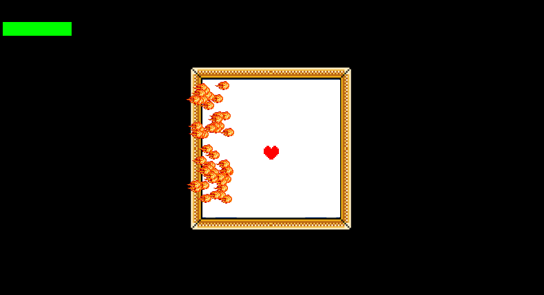

# Chronometra


> Introducing Choronometra!

---

### Table of Contents
Feel free to click the links and skip around!

- [Description](#description)
- [How To Play](#how-to-play)

---

## Description

Chronometra is an adventure RPG with two levels and a three-stage bossfight, 
featuring original art and gameplay. In the game, players play as RB, who must collect 
the four ores of Metrochron and place them into the altars of the Mountain Locck before 
summoning the Demon of Wrath and defeating him once and for all.

Chronometra was inspired largely in part by Undertale and various other RPGs, whose influence
can be seen in Chronometra's art and gameplay.

Chronometra was coded with PyGame, and uses PyTMX to load maps. The maps and the 
obstacles were made using Tiled, while the graphics were made in Photoshop.

#### Python Concepts Used
- Classes and functions are used to create various parts of the game.
- Integers, floats, strings, lists, and dictionaries are used to keep 
track of different types of data.
- Conditionals and loops are used throughout to enrich gameplay. 

[Back To The Top](#Chronometra)

---

## How To Play

#### Required Python Packages
To run the game, the following packages need to be installed.
- PyGame (https://www.pygame.org/)
- PyTMX (https://pypi.org/project/PyTMX/)


They can be installed by using the command prompt and the following commands.

```
pip install pygame

pip install pytmx
```

#### Installation

To play the game, the repository must be either downloaded or cloned. 

Then, after installing the required packages, run 'main.py' and enjoy the game!

#### Gameplay Guide

To move the character, both the arrow keys and the WASD keys can be used.

W / ↑ = Move Up

A / ← = Move Left

S / ↓ = Move Down

D / → = Move Right

 

The objective of the first part game is to collect all the four ores (highlighted 
with their respective colours in the image above), and 
to place them on their respective altars (highlighted with their respective
colours in the image below) in order to access the bossfight.

 

This is done by merely moving RB over the four ores and moving the 
character over the altars.

Note: RB can only move from the first level to the second after all 
the ores are collected.

Likewise, RB can only move from the second level to the altar after all 
the ores are placed onto their altars.

To access the boss battle, move RB to the central altar.


The boss battle consists three stages. Here, RB is represented by a red heart.


Every time RB takes damage or makes a hot-tempered decision, 
RB's rage increases and his health decreases.


This is represented by this green and red bar, where the green represents 
RB's health and the red represents RB's rage.


If RB's rage bar is full before reaching the ending, 
the game is over, and the game must be replayed.

To reach the ending, RB must survive the Demon of Wrath's damaging abilities 
for three stages while choosing to "Fight" or "Act."

In the first stage, RB must avoid as many fireballs 
as possible or take immense damage.



In the second stage, RB must run from the laser strikes 
or lose a lot of health.


In the third stage, RB must steer clear from the many fire 
spirits or be filled with rage.


Depending on RB's choices, there will be different endings.

#### Gameplay Example

Here is a video demonstrating Chronometra's gameplay.

https://www.youtube.com/watch?v=Ct9WFiI91SQ

[Back To The Top](#Chronometra)